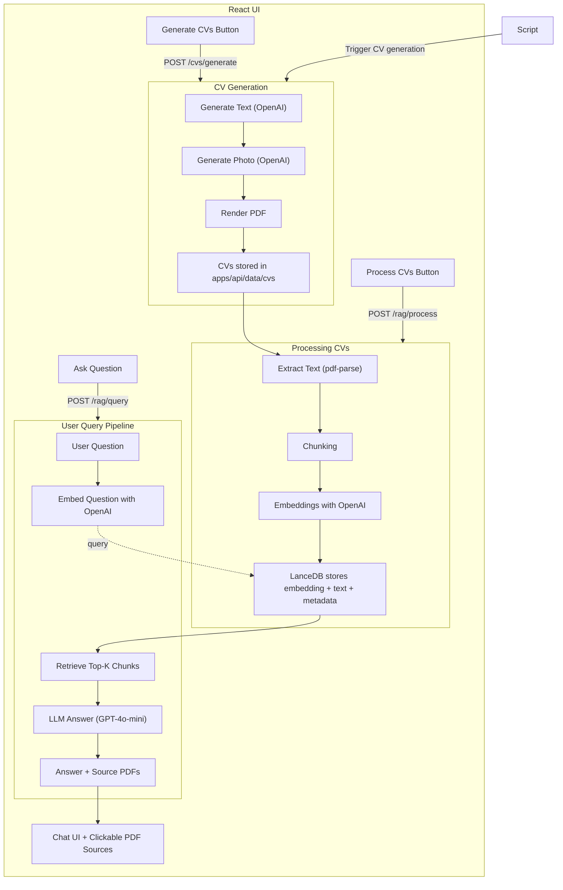

# AI-Powered CV Search (RAG Workflow)

This project demonstrates an **AI-powered CV search system** that generates fake resumes, indexes them, and allows semantic queries through a RAG (Retrieval-Augmented Generation) workflow.

---

## 🖼️ Architecture Diagram



---

## 🚀 Features

1. **CV Generator**

   * Generates fake resumes (OpenAI).
   * Each CV includes:

     * Fake contact info
     * Skills
     * Work experience
     * Education
     * AI-generated photo (OpenAI `images.generate`).
   * Exported as styled PDF.

2. **RAG Workflow**

   * Extracts text from PDFs using `pdf-parse`.
   * Splits text into overlapping chunks.
   * Embeds chunks with OpenAI (`text-embedding-3-small`).
   * Stores embeddings + metadata (source file, chunk index) in **LanceDB**.

3. **Query**

   * User submits a natural-language question.
   * The system retrieves the most relevant chunks (vector similarity search).
   * The LLM (`gpt-4o-mini`) answers using **only the retrieved context**.
   * Always answers in the language of the query. Uses english by default.
   * Returns answer + source PDFs as links.

4. **UI**

   * Built with React + Vite + Tailwind.
   * Chat-like interface (similar to ChatGPT).
   * Buttons for:

     * **Generate CVs** → runs backend CV generation script.
     * **Process CVs** → ingests PDFs into LanceDB.
   * Query box with conversational results and clickable PDF sources.

5. **API**

    * Express.js server with routes for:
        * **POST /cvs/generate → Generates CVs.
        * **POST /rag/process → Processes PDFs into LanceDB.
        * **POST /rag/query → Queries the vector DB with natural language.

    * Data is stored locally in data/cvs (PDFs) and data/embeddings (LanceDB).

---

## 📂 Project Structure

```
project-root/
│
├── apps/
│   └── api/                    # Express backend
│       ├── data/               # Local storage
│       │   ├── cvs/            # Generated CV PDFs
│       │   └── embeddings/     # LanceDB files
│       ├── scripts/            # One-off scripts
│       │   └── generate-cvs.ts
│       ├── src/
│       │   ├── index.ts        # API entrypoint
│       │   ├── routes/         # Express routes
│       │   │   ├── generate.ts
│       │   │   └── rag.ts
│       │   ├── services/       # Business logic
│       │   │   ├── generate-cvs/
│       │   │   │   ├── index.ts
│       │   │   │   ├── photos.ts
│       │   │   │   ├── render.ts
│       │   │   │   └── text.ts
│       │   │   └── rag/
│       │   │       ├── process.ts
│       │   │       └── query.ts
│       │   └── utils/
│       │       └── lancedb.ts
│       └── package.json
│
│   └── web/                    # React frontend
│       ├── public/
│       ├── src/
│       │   ├── pages/
│       │   │   └── ChatPage.tsx
│       │   ├── components/
│       │   │   ├── ChatBox.tsx
│       │   │   ├── ChatInput.tsx
│       │   │   ├── ChatMessage.tsx
│       │   │   ├── GenerateButton.tsx
│       │   │   └── ProcessButton.tsx
│       │   ├── lib/
│       │   │   └── api.ts
│       │   ├── App.tsx
│       │   ├── main.tsx
│       │   └── index.css
│       └── package.json
│
├── pnpm-workspace.yaml         # Monorepo config
├── package.json
└── README.md
```

---

## 3. Setup

1. Clone repo:

   ```bash
   git clone <repo-url>
   cd <repo>
   ```

2. Install dependencies:

   ```bash
   pnpm install
   ```

3. Run script to generate CVs (in root folder):

   ```bash
   pnpm gen:cvs
   ```

4. Start API and Frontend:

   ```bash
   pnpm dev:api   # API on localhost:3000
   pnpm dev:web   # Frontend on localhost:5173
   ```

5. Open the frontend and use the UI to query.

---

## 🔑 Key Decisions

* **OpenAI** for embeddings + LLM + image generation (consistent ecosystem).
* **LanceDB** as a lightweight, file-based vector store (simple, no cloud dependency).
* **Express + React** for minimal API + UI.
* **RAG** to guarantee answers are grounded in ingested CVs.

---

## 🚀 Possible Improvements

* Add **re-ranking** for more accurate chunk retrieval.
* Detect query **language automatically** and enforce answer language.
* Improve **chunking strategy** (e.g., semantic chunking with sentence boundaries).
* Store more metadata (e.g., candidate name, role).
* Scale to **Pinecone / Weaviate / Postgres pgvector** for production.
* Add **streaming responses** in UI.
* Fine-tune styling for PDF CVs.
